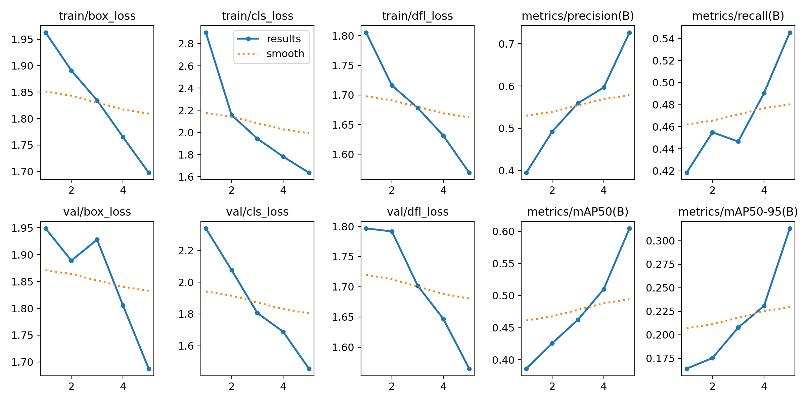
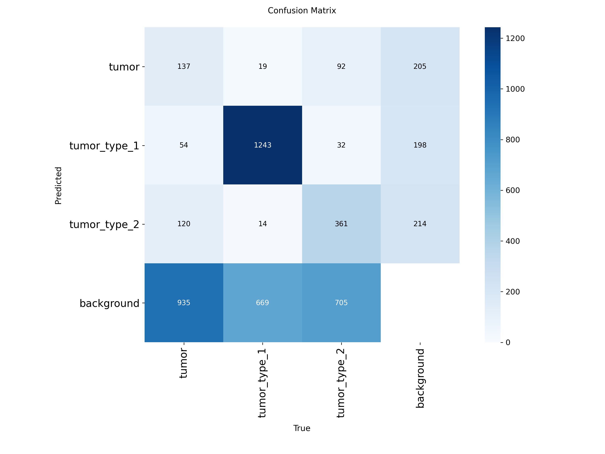
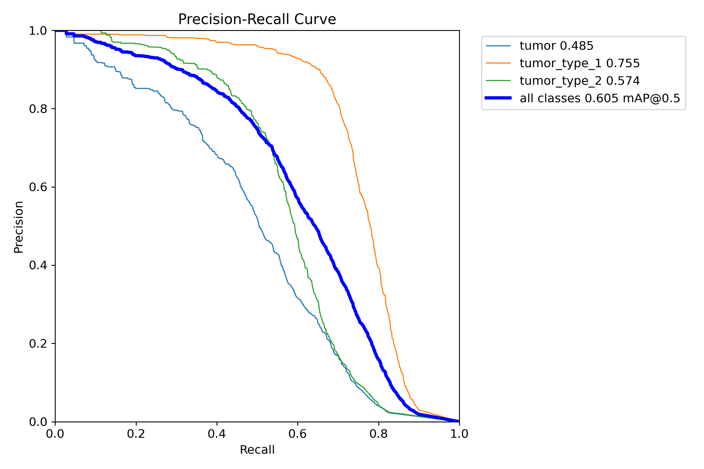
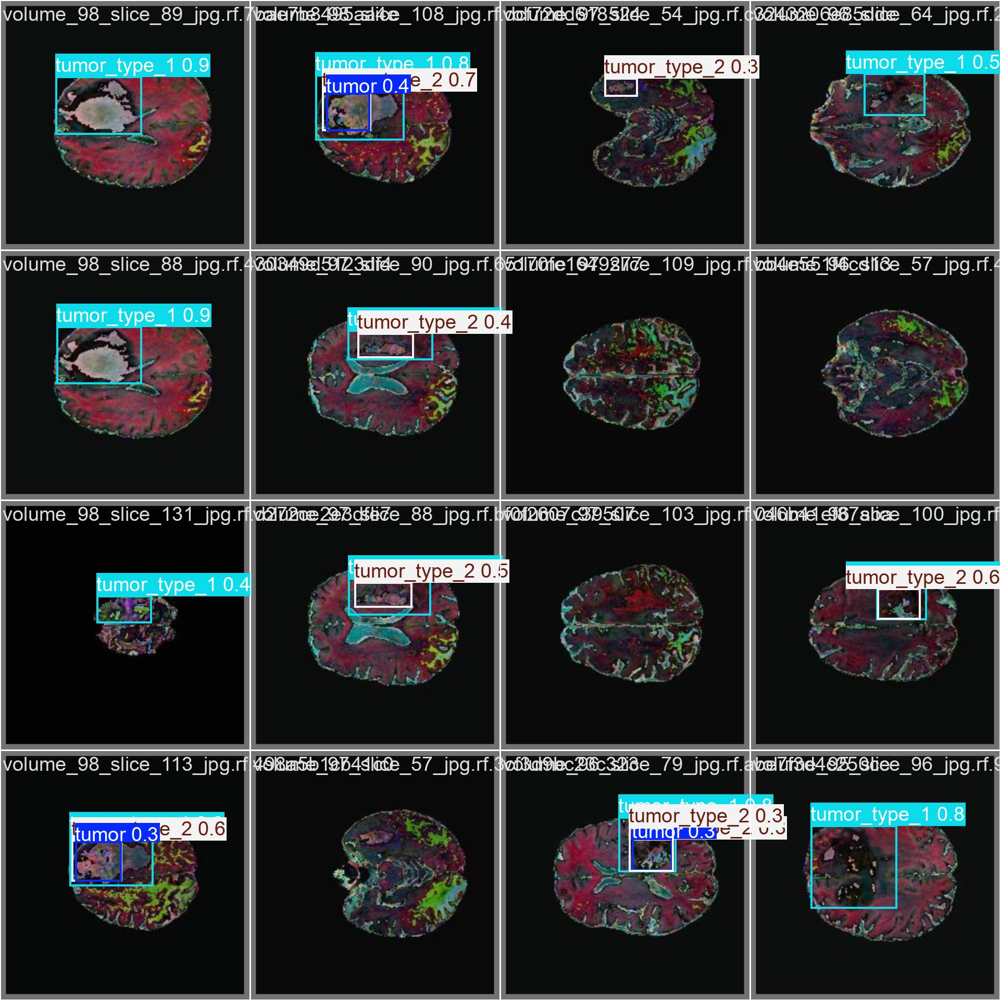

# 🧠 Brain Tumor Detector

A real-time brain tumor detection app built with **YOLOv8** and **Streamlit**, trained on MRI scan data using Google Colab.


---

## 🔍 Classes Detected

| Class | Color |
|-------|-------|
| `tumor` | 🔴 Red |
| `tumor_type_1` | 🟠 Orange |
| `tumor_type_2` | 🟣 Purple |

---

## 🚀 Run Locally

```bash
git clone https://github.com/YOUR_USERNAME/brain-tumor-detector
cd brain-tumor-detector

pip install -r requirements.txt

streamlit run app.py
```

Make sure `best.pt` is in the same folder as `app.py`.

---

## 📊 Training Results

Trained for **5 epochs** on **YOLOv8n** (nano) with image size 640×640, batch size 16, on CPU via Google Colab.

| Metric | Value |
|--------|-------|
| **Precision** | 72.7% |
| **Recall** | 54.5% |
| **mAP@50** | 60.4% |
| **mAP@50-95** | 31.3% |

> Results from epoch 5 (best checkpoint).

### Training Curves


### Confusion Matrix


### Precision-Recall Curve


### Sample Predictions (Validation Set)


---

## ⚙️ Training Config

| Parameter | Value |
|-----------|-------|
| Model | YOLOv8n (nano, pretrained) |
| Epochs | 5 |
| Image size | 640×640 |
| Batch size | 16 |
| Optimizer | Auto |
| Device | CPU |
| Augmentation | HorizontalFlip, RandomBrightnessContrast, ShiftScaleRotate |

---

## 📁 Project Structure

```
brain-tumor/
├── assets                        # contain logo and test images 
├── app.py                        # Streamlit app
├── best.pt                       # Trained YOLOv8 weights
├── requirements.txt
├── brainT_proj.ipynb             # Colab training notebook
├── sample_images/                # Test MRI images
└── train/                        # Training logs & result plots
    ├── results.png
    ├── confusion_matrix.png
    ├── BoxPR_curve.png
    └── val_batch0_pred.jpg
```

---

## 📓 Training Notebook

See `brainT_proj.ipynb` for the full pipeline — dataset prep, augmentation, YOLOv8 fine-tuning, and evaluation.

---

## 📦 Dataset

Trained on the [Brain Tumor Datasets](https://www.kaggle.com/datasets/taruneshmehra/brain-tumor-datasets) by Tarunesh Mehra on Kaggle.
